# Degree and Synapse Distributions Report

**Note on Terminology**: `incoming_synapse_count` and `outgoing_synapse_count` strictly denote the physical tally (sum) of `synapse_count`. There is absolutely NO implication that these values represent synaptic weight, conductance, current, efficacy, or physiological strength.

## structural_in_degree

### Statistics
- **min**: 0.0000
- **max**: 6261.0000
- **mean**: 26.8031
- **median**: 14.0000
- **std**: 60.6233
- **p01**: 0.0000
- **p05**: 0.0000
- **p25**: 7.0000
- **p50**: 14.0000
- **p75**: 26.0000
- **p95**: 96.0000
- **p99**: 214.0000
- **p99.9**: 668.0000

### High Degree Nodes (Top 50)
`720575940626979621, 720575940628908548, 720575940613583001, 720575940624547622, 720575940620975696, 720575940625934094, 720575940628307026, 720575940629513222, 720575940625952755, 720575940622523508, 720575940627497244, 720575940640851363, 720575940620008758, 720575940634612194, 720575940619991862, 720575940650935673, 720575940628069501, 720575940633305681, 720575940640736371, 720575940632504874, 720575940627190556, 720575940621801819, 720575940621116807, 720575940623133097, 720575940623888397, 720575940637689486, 720575940618554041, 720575940606692542, 720575940631306284, 720575940640263989, 720575940615743650, 720575940630810306, 720575940632427603, 720575940613686698, 720575940632403986, 720575940623499132, 720575940629382150, 720575940611563310, 720575940623636701, 720575940631999685, 720575940621164720, 720575940629856515, 720575940617749538, 720575940630496374, 720575940613455986, 720575940623444044, 720575940629422086, 720575940630864847, 720575940627706398, 720575940610964946`

### Plots
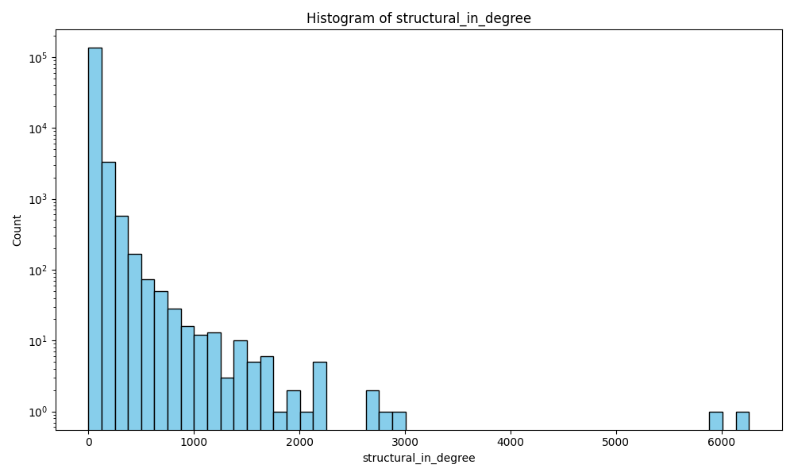
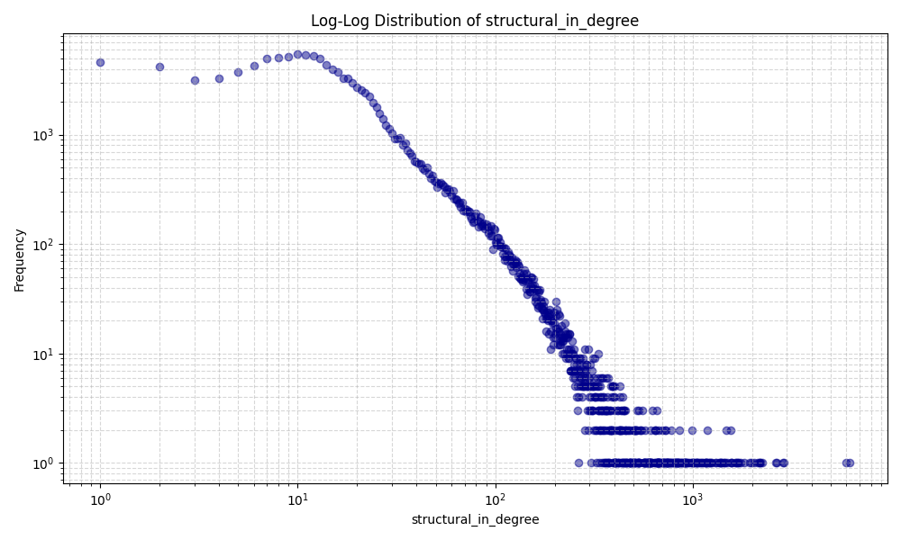

## structural_out_degree

### Statistics
- **min**: 0.0000
- **max**: 6523.0000
- **mean**: 26.8031
- **median**: 17.0000
- **std**: 54.4075
- **p01**: 0.0000
- **p05**: 2.0000
- **p25**: 9.0000
- **p50**: 17.0000
- **p75**: 31.0000
- **p95**: 75.0000
- **p99**: 170.0000
- **p99.9**: 590.0000

### High Degree Nodes (Top 50)
`720575940626979621, 720575940628908548, 720575940613583001, 720575940624547622, 720575940625952755, 720575940620008758, 720575940627497244, 720575940632777320, 720575940625049781, 720575940629382150, 720575940625525740, 720575940613065130, 720575940618444473, 720575940628307026, 720575940635684762, 720575940612976497, 720575940629513222, 720575940626044942, 720575940631945815, 720575940620975696, 720575940627996285, 720575940650935673, 720575940628038808, 720575940628069501, 720575940625000200, 720575940631190016, 720575940637689486, 720575940631306284, 720575940634612194, 720575940625934094, 720575940611563310, 720575940632795532, 720575940623444044, 720575940621116807, 720575940609282825, 720575940623000858, 720575940619991862, 720575940639209956, 720575940634545890, 720575940625741287, 720575940640736371, 720575940628406538, 720575940609137500, 720575940627706398, 720575940627502338, 720575940628082053, 720575940628360506, 720575940633305681, 720575940614710509, 720575940632069583`

### Plots
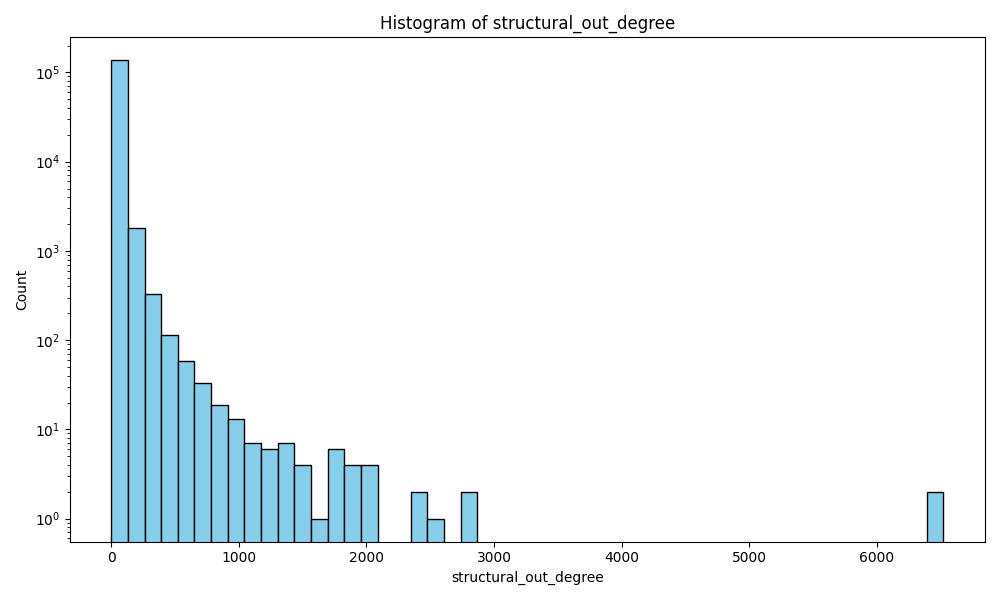
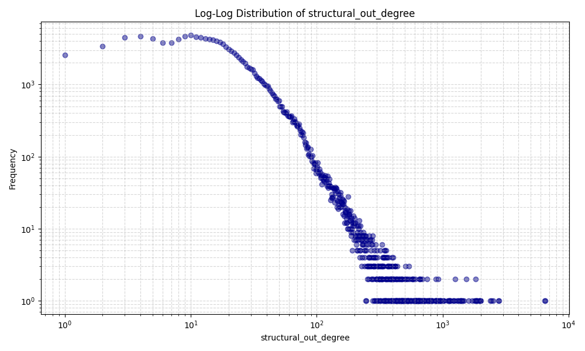

## structural_total_degree

### Statistics
- **min**: 0.0000
- **max**: 12784.0000
- **mean**: 53.6061
- **median**: 32.0000
- **std**: 108.2122
- **p01**: 2.0000
- **p05**: 4.0000
- **p25**: 17.0000
- **p50**: 32.0000
- **p75**: 58.0000
- **p95**: 167.0000
- **p99**: 373.0000
- **p99.9**: 1134.0000

### High Degree Nodes (Top 50)
`720575940626979621, 720575940628908548, 720575940613583001, 720575940624547622, 720575940625952755, 720575940627497244, 720575940620975696, 720575940620008758, 720575940628307026, 720575940629513222, 720575940625934094, 720575940650935673, 720575940634612194, 720575940629382150, 720575940628069501, 720575940619991862, 720575940637689486, 720575940622523508, 720575940631306284, 720575940621116807, 720575940640736371, 720575940640851363, 720575940633305681, 720575940611563310, 720575940625049781, 720575940613065130, 720575940618444473, 720575940625000200, 720575940635684762, 720575940623888397, 720575940623444044, 720575940618554041, 720575940639209956, 720575940613686698, 720575940632795532, 720575940632504874, 720575940627706398, 720575940621801819, 720575940627190556, 720575940623133097, 720575940632777320, 720575940623499132, 720575940627502338, 720575940625525740, 720575940628406538, 720575940623000858, 720575940632403986, 720575940609282825, 720575940634545890, 720575940626044942`

### Plots
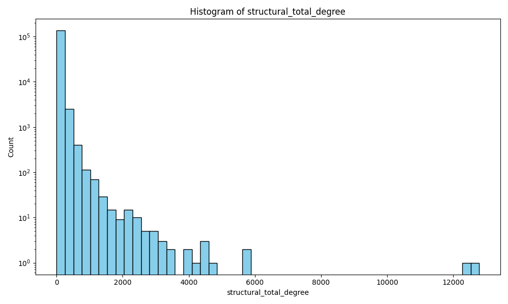
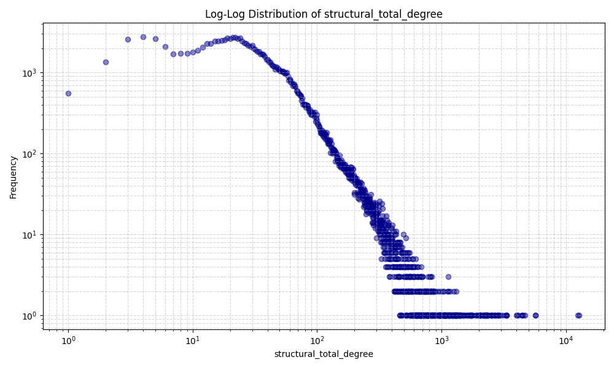

## incoming_synapse_count

### Statistics
- **min**: 0.0000
- **max**: 87524.0000
- **mean**: 363.8408
- **median**: 152.0000
- **std**: 1069.9001
- **p01**: 0.0000
- **p05**: 0.0000
- **p25**: 69.0000
- **p50**: 152.0000
- **p75**: 316.0000
- **p95**: 1326.0000
- **p99**: 3757.0000
- **p99.9**: 11858.0000

### High Degree Nodes (Top 50)
`720575940624547622, 720575940613583001, 720575940626979621, 720575940628908548, 720575940634612194, 720575940620975696, 720575940625934094, 720575940619991862, 720575940628307026, 720575940627497244, 720575940625952755, 720575940650935673, 720575940640736371, 720575940628069501, 720575940633305681, 720575940629513222, 720575940627190556, 720575940632504874, 720575940640834211, 720575940620008758, 720575940638900713, 720575940630810306, 720575940626783065, 720575940615743650, 720575940625102224, 720575940604088288, 720575940622523508, 720575940611563310, 720575940612264817, 720575940640851363, 720575940608545219, 720575940604569824, 720575940620023686, 720575940632403986, 720575940624931888, 720575940632427603, 720575940605899692, 720575940622364854, 720575940617691734, 720575940618554041, 720575940627796298, 720575940623636701, 720575940639209956, 720575940618366843, 720575940623444044, 720575940621801819, 720575940621689727, 720575940613686698, 720575940629513478, 720575940624973831`

### Plots
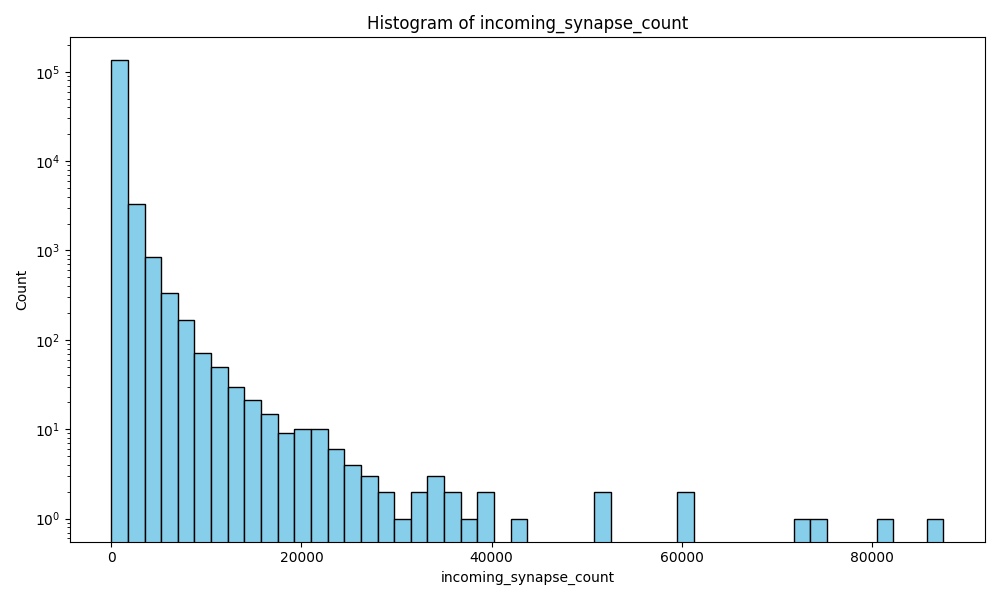
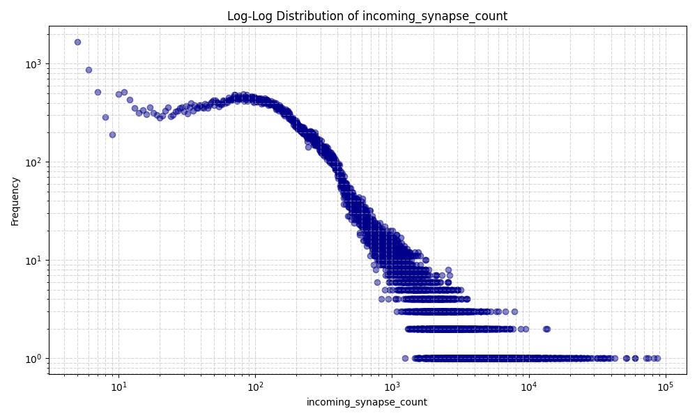

## outgoing_synapse_count

### Statistics
- **min**: 0.0000
- **max**: 110708.0000
- **mean**: 363.8408
- **median**: 175.0000
- **std**: 960.3077
- **p01**: 0.0000
- **p05**: 22.0000
- **p25**: 97.0000
- **p50**: 175.0000
- **p75**: 355.0000
- **p95**: 1203.0000
- **p99**: 3139.0000
- **p99.9**: 9908.0000

### High Degree Nodes (Top 50)
`720575940626979621, 720575940628908548, 720575940624547622, 720575940613583001, 720575940625952755, 720575940627497244, 720575940620008758, 720575940634612194, 720575940619991862, 720575940611563310, 720575940628307026, 720575940623444044, 720575940612976497, 720575940618308825, 720575940622726271, 720575940629513222, 720575940631945815, 720575940640834211, 720575940629382150, 720575940650935673, 720575940626462014, 720575940632795532, 720575940638900713, 720575940628069501, 720575940608545219, 720575940622523508, 720575940612718563, 720575940609282825, 720575940619071005, 720575940627796298, 720575940625741287, 720575940630770042, 720575940623000858, 720575940640851363, 720575940627190556, 720575940632504874, 720575940634545890, 720575940626403917, 720575940640736371, 720575940636543668, 720575940604569824, 720575940625049781, 720575940618366843, 720575940637689486, 720575940620975696, 720575940613065130, 720575940632777320, 720575940625102224, 720575940625525740, 720575940618444473`

### Plots
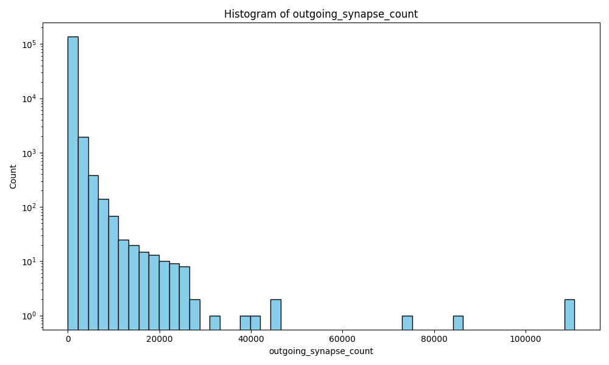
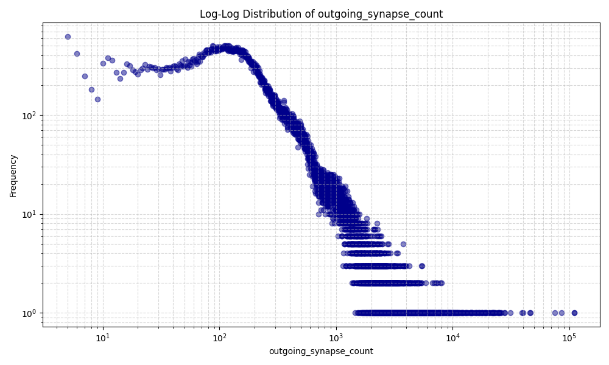

## total_synapse_count

### Statistics
- **min**: 0.0000
- **max**: 185213.0000
- **mean**: 727.6816
- **median**: 330.0000
- **std**: 1928.1488
- **p01**: 19.0000
- **p05**: 65.0000
- **p25**: 180.0000
- **p50**: 330.0000
- **p75**: 674.0000
- **p95**: 2441.0000
- **p99**: 6678.0000
- **p99.9**: 20783.0000

### High Degree Nodes (Top 50)
`720575940626979621, 720575940628908548, 720575940624547622, 720575940613583001, 720575940634612194, 720575940627497244, 720575940625952755, 720575940619991862, 720575940620975696, 720575940620008758, 720575940628307026, 720575940625934094, 720575940650935673, 720575940629513222, 720575940628069501, 720575940640834211, 720575940640736371, 720575940627190556, 720575940632504874, 720575940611563310, 720575940633305681, 720575940638900713, 720575940622523508, 720575940623444044, 720575940608545219, 720575940640851363, 720575940625102224, 720575940627796298, 720575940626783065, 720575940630810306, 720575940604569824, 720575940604088288, 720575940612264817, 720575940615743650, 720575940629382150, 720575940632795532, 720575940618366843, 720575940618308825, 720575940632403986, 720575940622726271, 720575940609282825, 720575940623000858, 720575940637689486, 720575940610584184, 720575940634545890, 720575940639209956, 720575940623636701, 720575940605899692, 720575940627706398, 720575940624931888`

### Plots
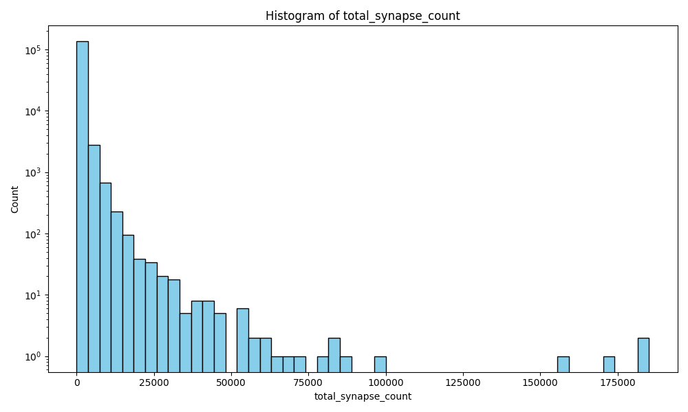
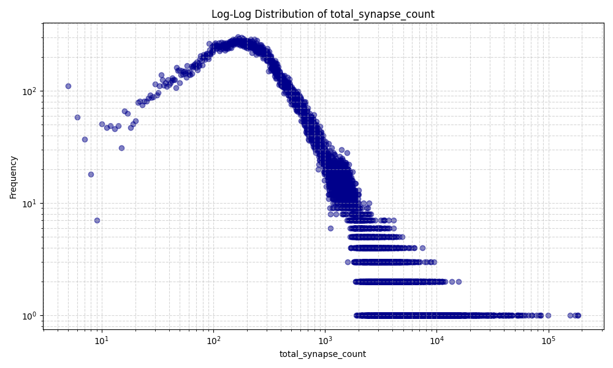

