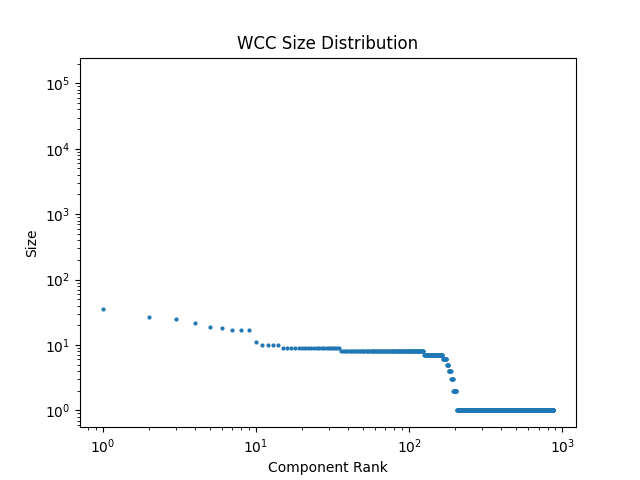
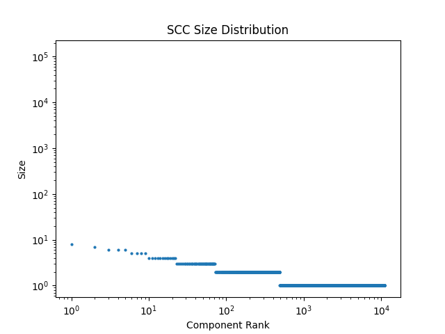

# Topology Analysis Report

## Metrics
- **Nodes**: 139255
- **Edges (raw)**: 5342446
- **Unique Directed Edges**: 3732460
- **Density**: 1.924747e-04 (observed unique directed edges / (N * N))
- **Reciprocity**: 0.1662 (E_recip / E_total (where E_recip is number of directed edges with a counterpart))
- **Reciprocal Pairs**: 310090

## Components
- **Weakly Connected Components (WCC)**: 875
- **Largest WCC Size**: 136997
- **Strongly Connected Components (SCC)**: 11120
- **Largest SCC Size**: 127536
- **Isolated Nodes**: 671

## Plots

